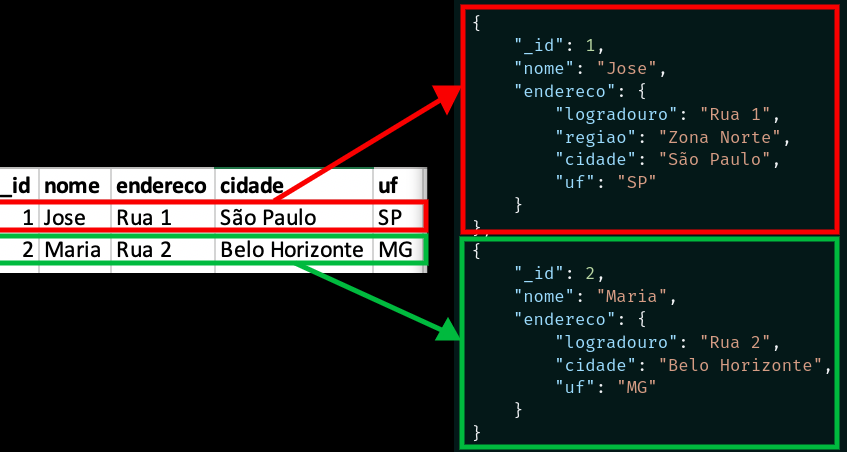

<!-- Puxando imagem -->
docker pull mongo:4
<!-- Executando imagem -->
docker run --name <nome-do-container> -d mongo:4
docker run --name <nome-do-container> -d -p 27017:27017 mongo:4
<!-- Executando o sh -->
docker exec -it <nome-do-container-ou-id> mongo
docker exec -it <nome-do-container-ou-id> mongosh
<!-- Copiando arquivos locais para dentro do container com mongoimport -->
docker cp nome-do-arquivo.json <nome-do-container-ou-id>:/tmp/nome-do-arquivo.json
docker exec <nome-do-container-ou-id> mongoimport -d <nome-do-banco> -c <nome-da-coleção> --file /tmp/nome-do-arquivo.json
<!-- Importando uma matriz (array) de dados com mongoimport -->
docker exec <nome-do-container-ou-id> mongoimport --collection='from_array_file' --file='one_big_list.json' --jsonArray

docker exec mongodb mongoimport --collection='from_array_file' --file='/tmp/arquivo-teste.json' --jsonArray 

<!-- Primeiros comandos -->
use nomeDoBanco
db.nomeDaColecao.insertOne({ x: 1 })

A criação é feita de maneira automatica, tanto da db, quanto da coleção. Para criar coleções explicitamente:
db.createCollection( "nomeDaColecao", { collation: { locale: "pt" } } );

Você pode fazer modificações nos parâmetros de uma coleção através do collMod.

Comparação SQL e NoSQL:

<!-- Comandos -->
insertOne - insertMany
find